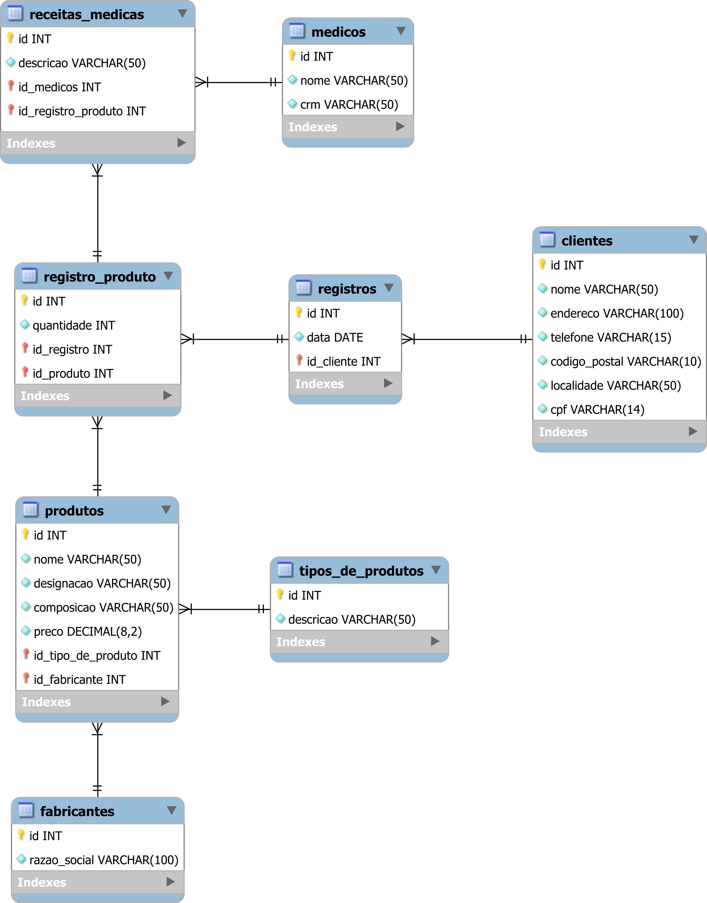

# Project

Systems analysts are developing a system for a company and have been doing several interviews with employees from different areas. At the end of this requirements analysis, a descriptive document was generated with what will be needed for the system.

## Description

A pharmacy sells various types of products (medicines, cosmetics, etc.). In addition to the type, the code, designation, composition, manufacturer and sales price are recorded for each product. When a customer buys a product for the first time, his data (name, address, telephone, postal code, city and taxpayer number) are recorded.

Once registered, whenever a customer buys a particular product, their customer code, the products purchased, the doctor's name (in the case of medical prescriptions), as well as the total sales are registered. Each purchase is identified by a number to facilitate database queries.

## ER Diagram

