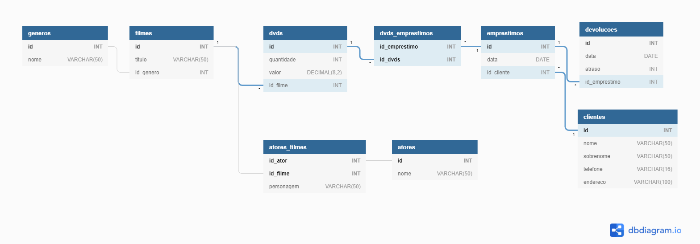

# Project

Systems analysts are developing a system for a company and have been doing several interviews with employees from different areas. At the end of this requirements analysis, a descriptive document was generated with what will be needed for the system.

Your task is to analyze this document, extract the entities, fields, relationships and generate the Entity and Relationship Model.

## Description

A small video rental store has around 2000 DVDs, whose borrowing must be controlled. Each DVD has an identification number and contains a single movie. Each film receives its own identifier, and the title and category are known (comedy, drama, adventure, …).

For each movie registered there is at least one DVD. Also, longer movies require two DVDs. Customers may want to find movies starring their favorite actor. Therefore, it is necessary to keep information on the actors who star in each movie, but not every movie has stars.

Many customers, when they see the list of actors of the chosen movie, are interested in knowing, for a certain actor, his real name and which other movies of the same genre that actor participated in. The rental company has many registered customers, whose name, surname, telephone and contact address are known. In addition, each customer is assigned a membership number.

Finally, the system should allow consulting of DVD loans, with information on which customer rented what, loan and return dates, amount paid or payable, delays, etc.

## ER Diagram

